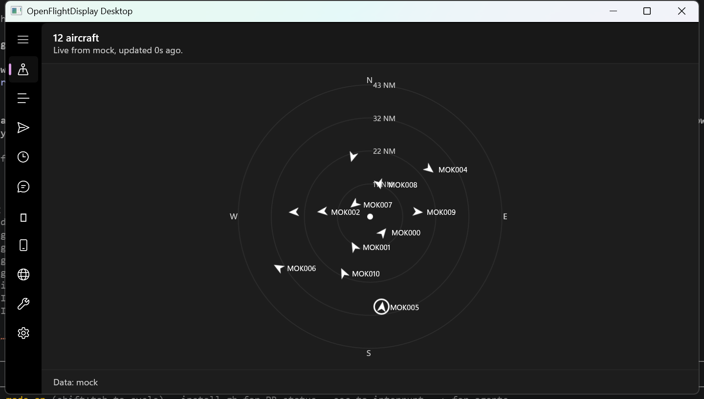
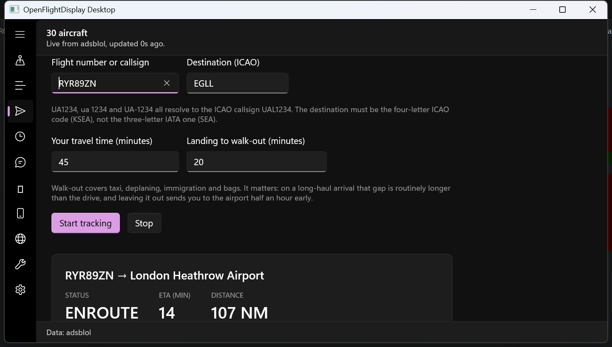
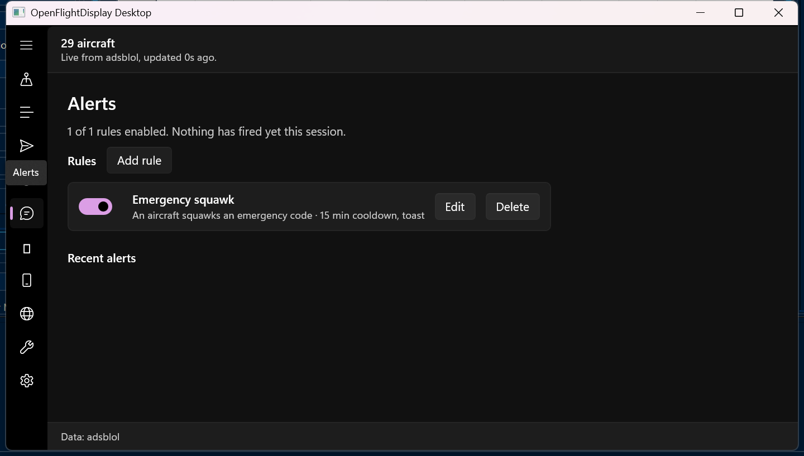
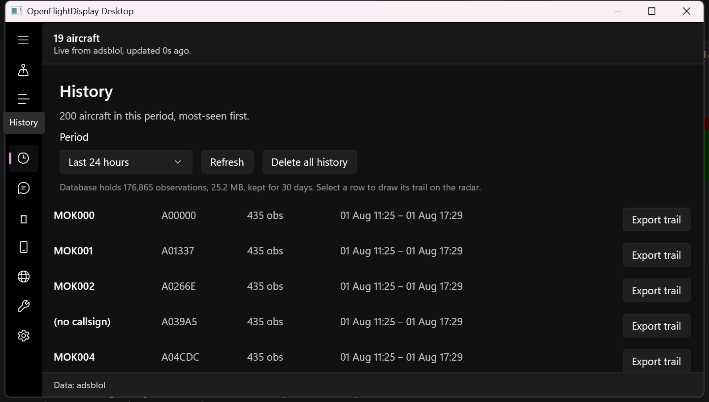
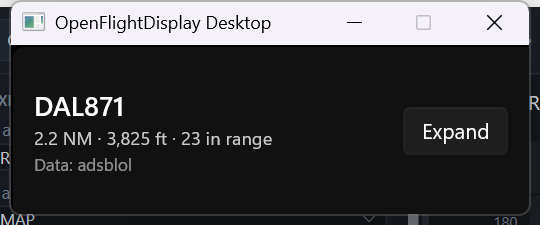

# OpenFlightDisplay Desktop — troubleshooting

Every symptom here has actually happened during development, and most of them
cost real time. They are ordered by how often they come up, not by severity.

## Screenshots

What a working app looks like, captured on a 1920×1200 display at 150% scaling.

| | |
|---|---|
|  | **Live Radar** — range rings, cardinal marks, heading-oriented symbols |
|  | **Track Flight** — phase, ETA, distance and departure advice |
|  | **Alerts** — rules with per-rule cooldown and quiet hours |
|  | **History** — recorded aircraft, most-seen first |
|  | **Compact mode** — always on top, nearest aircraft only |

---

## The app does nothing when I launch it

**Almost always a stale process.** The app is single-instance: a second launch
hands activation to the first one and exits with success. If an earlier build is
still running — including one you thought you closed — your new launch is
absorbed by it and you see the *old* build.

```powershell
Get-Process OpenFlightDisplay.App -ErrorAction SilentlyContinue | Stop-Process -Force
```

This caught out two separate sessions. Check Task Manager before concluding a
rebuild did not take effect.

## The app exits immediately with no window

Look at the exit code. `-1073741189` is `0xC000027B`, a **stowed WinRT
exception** — an unhandled managed exception during startup, usually from XAML.

```powershell
$p = Start-Process .\OpenFlightDisplay.App.exe -PassThru
Start-Sleep 10
if ($p.HasExited) { "exit code $($p.ExitCode)" }
```

The exit code alone tells you nothing about the cause. Get the real error from
Windows Error Reporting:

```powershell
Get-WinEvent -FilterHashtable @{LogName='Application'; StartTime=(Get-Date).AddMinutes(-10)} |
  Where-Object { $_.Message -match 'OpenFlightDisplay' } | Select-Object -First 3 |
  ForEach-Object { $_.Message }
```

An HRESULT of `0x80004003` (`E_POINTER`) with `Microsoft.UI.Xaml.dll` as the
faulting module means a handler ran against a control that did not exist yet.

**The known cause:** a `ComboBoxItem` with `IsSelected="True"` in markup, inside
a `ComboBox` that has a `SelectionChanged` handler. The event fires *during*
`InitializeComponent`, before the rest of the page is built. Choose the default
in the constructor with events suppressed instead. This is item 16 in the "things
not to undo" list in the backlog.

## `dotnet` is not recognised

It is installed but not on `PATH` on this machine:

```powershell
$env:PATH = "C:\Program Files\dotnet;$env:PATH"
```

## The board is empty

Four different causes, and the app distinguishes them — read the status line
rather than guessing:

| Status says | Cause |
|---|---|
| *"Nothing matches your filter"* | Your own filter. It names the filter; clear it in **Settings → Show only** |
| *"No aircraft in range"* | Genuinely nothing in the monitoring area. Widen the radius |
| *"Replay complete"* | The recording ran out. Load another, or switch data source |
| *"Setup required"* / an error | No home location, or the provider failed |

A common self-inflicted one: a **cone** monitoring area left pointing the wrong
way, which looks exactly like an empty sky. Check **Monitoring Areas** — the page
states the current shape in words.

## Alerts never fire

Work down this list:

1. **Is a rule enabled?** The Alerts page says *"N of M rules enabled"*.
2. **Is the trigger reachable?** `EntersArea` and `ExitsArea` need a monitoring
   area; without a home location they can never match, and the rule editor warns
   about this when you pick the trigger.
3. **Cooldown.** A rule that already fired for an aircraft stays quiet for its
   cooldown — 15 minutes for the built-in emergency rule.
4. **Quiet hours.** Check the rule summary line.
5. **Per-poll cap.** At most 5 alerts fire per poll, by design. The Diagnostics
   page shows the cap.

Note that **alerts fire and are recorded even with notifications switched off** —
the master switch only governs Windows toasts. If the in-app list is empty, the
rule genuinely did not match.

## Selecting Replay says "complete" immediately

No recording is loaded. Go to **Data Sources → Load recording…**. To make one,
press **Start recording** while a live source is running.

Recordings live in `%APPDATA%\OpenFlightDisplay\recordings\` as `.ofdreplay`
files — JSON Lines, so you can inspect one in a text editor.

## History is empty

History is **off by default**, deliberately: it keeps a record of everything
that flies over you. Turn it on in **Settings → Flight history**. Nothing before
that point was recorded, and switching it on does not backfill.

## Screenshots of the window look wrong

**Do not measure or capture this window from a DPI-unaware process.** PowerShell
is not per-monitor DPI aware, so `GetWindowRect` returns the window's physical
size *divided by* the display scale. Capturing that rect against the real screen
crops the window and looks exactly like a UI rendering too large.

This produced a phantom "DPI scaling defect" that sat at the top of the backlog
until it was disproved. Use the committed script, which sets per-monitor DPI
awareness on the calling thread first:

```powershell
./apps/windows-desktop/tools/Capture-Window.ps1 -Path radar.png -Foreground
```

## Where everything lives

```
%APPDATA%\OpenFlightDisplay\settings.json    settings
%APPDATA%\OpenFlightDisplay\history.db       observation history (SQLite)
%APPDATA%\OpenFlightDisplay\recordings\      replay recordings
```

Deleting `settings.json` re-triggers first-run onboarding. Deleting `history.db`
is equivalent to **History → Delete all history**, which also vacuums the file.

## Getting a state dump

**Diagnostics → Copy all to clipboard** produces feed state, history counters,
alert counts, environment and paths. It deliberately contains **no coordinates
and no callsigns**, so it is safe to paste into an issue.

Check the counters that should be zero — dropped history batches and dropped
replay frames. The page raises a warning bar when either is non-zero, which
normally means a slow or full disk.
